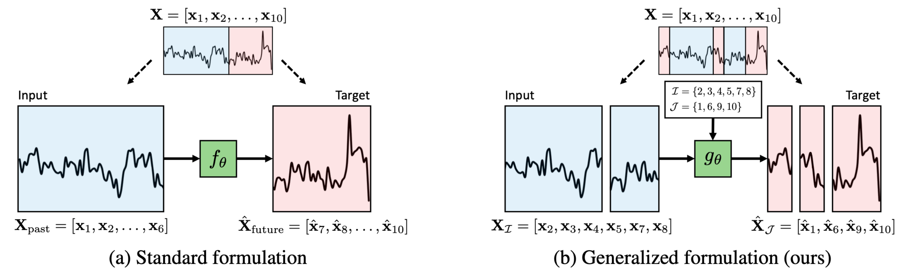
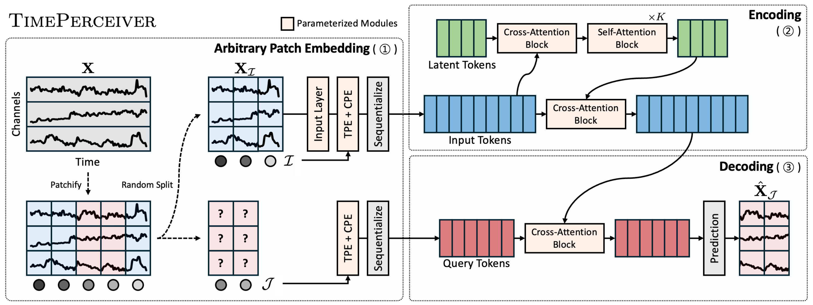
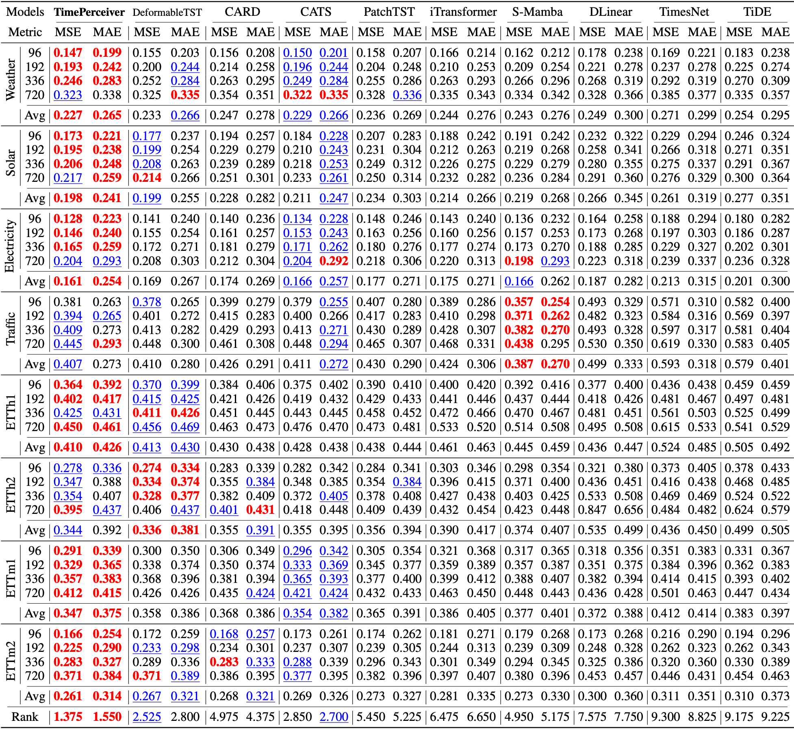
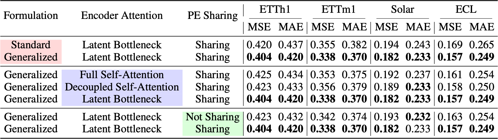
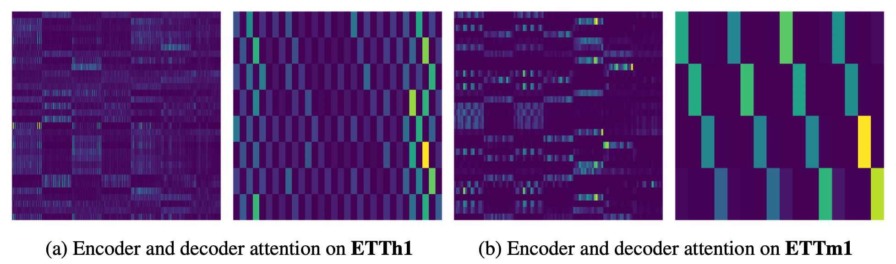

# TimePerceiver (NeurIPS 2025)

This repository is the official implementation of TimePerceiver: An Encoder-Decoder Framework for Generalized Time-Series Forecasting.

## Introduction

We propose **TimePerceiver**, a unified encoder-decoder forecasting framework paired with an effective training strategy. Specifically, we generalize the forecasting task to encompass diverse temporal prediction objectives, including extrapolation, interpolation, and imputation.

<p align="center">

</p>

## Overall Architecture
We design a novel encoder-decoder architecture that can flexibly perceive and adapt to varying input–target positions along the temporal axis. This design is particularly suitable for handling the generalized formulation of forecasting, where input and target segments may be arbitrarily positioned.  

<p align="center">

</p>

## Requirements

This code was experimented with Python 3.9. To install requirements:

```
pip install -r requirements.txt
```

We use the publicly available ETT, Weather, Solar, ECL, and Traffic datasets exactly as described in the paper. You can download these datasets from the following repository: [https://github.com/thuml/iTransformer](https://github.com/thuml/iTransformer)
For detailed information about each dataset, please refer to Appendix A of the paper.

## Train and Evaluate

To train and evaluate the model in the paper, we provide the scripts for all benckmarks under the folder `./scripts/`.  You can run the scripts using the following commands.
If you wish to customize any settings, we recommend modifying the corresponding files inside the `./scripts/` directory.

```
# ETT
bash ./scripts/ETT/TimePerceiver_ETTh1.sh
bash ./scripts/ETT/TimePerceiver_ETTh2.sh
bash ./scripts/ETT/TimePerceiver_ETTm1.sh
bash ./scripts/ETT/TimePerceiver_ETTm2.sh

# Weather
bash ./scripts/Weather/TimePerceiver.sh

# Solar
bash ./scripts/Solar/TimePerceiver.sh

# ECL
bash ./scripts/ECL/TimePerceiver.sh

# Traffic
bash ./scripts/Traffic/TimePerceiver.sh
```

## Experiments
We conduct extensive experiments that demonstrate our framework consistently and significantly outperforms prior state-of-the-art baselines across a wide range of benchmark datasets. Furthermore, through comprehensive ablation studies, we validate the effectiveness of our design and provide insights into how it operates.

### Multivariate Long-Term Time-Series Forecasting
In this experiment, we evaluate our framework on the challenging task of multivariate long-term time-series forecasting. The results are averaged over input lengths $L \in \lbrace 96, 384, 768 \rbrace$ and prediction lengths $H \in \lbrace 96, 192, 336, 720 \rbrace$. **Bold** indicates the best result, and <ins>underlined</ins> denotes the second best. Across these diverse settings, our method achieves a rank of **1.375** in MSE and **1.550** in MAE, consistently surpassing the recent state-of-the-art models.

<p align="center">

</p>

### Component Ablation Studies
In this part, we examine the impact of different design choices to validate our approach. Specifically, we replace or modify the proposed formulation, encoder, and decoder designs with alternative options. The results demonstrate that our original design consistently yields superior performance, confirming both the effectiveness and necessity of the proposed components.

<p align="center">

</p>

### Cross-Attention Analysis
We analyze how the key components, latent variables and decoder queries, attend to the input. The figure illustrates encoder latents and decoder queries aggregating information from the input across different datasets.

- **Latents**: Each latent captures distinct patterns or features, showing that the model compresses input information effectively while preserving representational diversity.  
- **Queries**: Decoder queries often align with regularly spaced input regions, revealing the exploitation of periodic patterns. In ETTh1, where each patch spans 12 hours, queries typically attend to patches about two steps apart, corresponding to a daily cycle (24 hours). In ETTm1, where each patch spans 6 hours, queries align with four-step intervals, matching a quarter-day rhythm. These resolution-aware alignments highlight the model's ability to adapt to dataset granularity and capture underlying periodic structures.

<p align="center">

</p>


## Acknowledgement
We sincerely thank the authors for providing high-quality open-source code.

- [Time-Series-Library](https://github.com/thuml/Time-Series-Library)  
- [iTransformer](https://github.com/thuml/iTransformer)  
- [DeformableTST](https://github.com/luodhhh/DeformableTST)

## Contact
If you have any questions, please feel free to reach out:

- jaebin.lee@skku.edu
- hankook.lee@skku.edu
